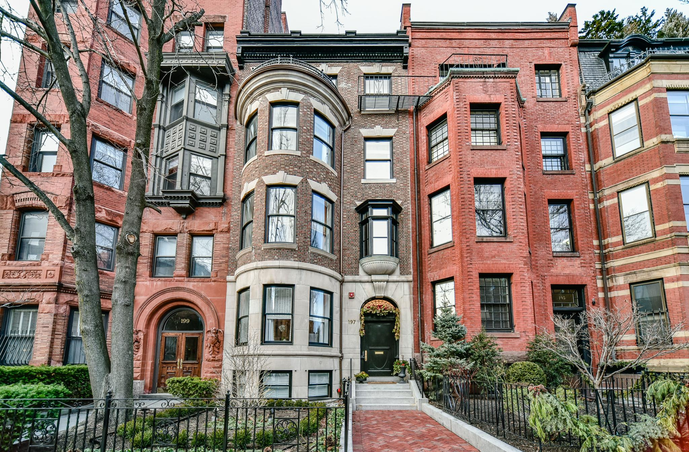

# Boston Houses

### [BI](https://bioinf.me/) statisctics course Project 2
> *by* Nikita Vaulin, Skoltech  
> Nikita.Vaulin@skoltech.ru

The dataset is taken from [GitHub](https://raw.githubusercontent.com/selva86/datasets/master/BostonHousing.csv).

This project is the first project in the course on statistics at the Bioinformatics Institute. 
In this project, you can see the standard techniques for the linear regression.

The project was completed with `python 3.9.10`. 

